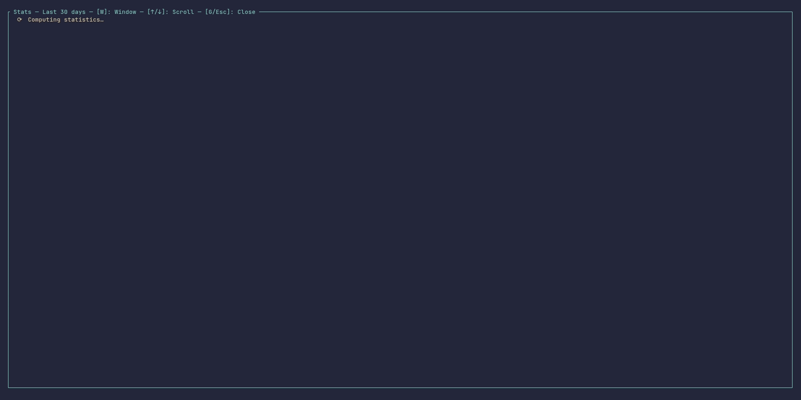

# gitlab-tracker-stats

Optional analytics and velocity-tracking plugin for [gitlab-tracker](../README.md).

Automatically records MR snapshots into a local SQLite database and computes velocity metrics, aggregated statistics, and Spearman rank correlations — all without leaving your terminal.



---

## ✨ What it measures

### Per-MR metrics

| Metric | Description |
| :--- | :--- |
| **Cycle time** | Elapsed time from MR creation to merge (in hours) |
| **Diff size** | Total changed lines (additions + deletions) |
| **Diff difficulty** | Pre-computed review score in \[0.0, 1.0\] (from your `complexity_profile`) |
| **Comment count** | Total human notes and discussion threads |
| **Comment density** | Notes per 100 changed lines — normalised discussion load |
| **Pipeline failure rate** | Fraction of pipeline runs that ended in `Failed` state |

### Aggregated statistics (per time window or milestone)

| Statistic | Description |
| :--- | :--- |
| **Throughput** | MRs merged per calendar week |
| **Cycle time median & P90** | Central tendency + long-tail indicator |
| **Cycle time by author** | Average cycle time per MR author — highlights who tends to have longer review cycles |
| **Cycle time by reviewer** | Average cycle time per assigned reviewer — surfaces review bottlenecks |
| **Cycle time by milestone** | Per-sprint velocity comparison |
| **Backlog age** | Age distribution of currently open MRs — identifies stagnant reviews |
| **Pipeline failure rate** | Average across all MRs in the window |

### Spearman rank correlations

All correlations use **Spearman's ρ** (rank-based, robust against outliers and non-normal distributions) with a two-tailed p-value approximated via the t-distribution.

| Pair | Question answered |
| :--- | :--- |
| **Diff size ↔ Cycle time** | Do larger MRs take longer to merge? |
| **Diff size ↔ Comments** | Do larger MRs generate more discussion? |
| **Comments ↔ Cycle time** | Are heavily commented MRs review bottlenecks? |
| **Pipeline failures ↔ Cycle time** | Does CI instability delay delivery? |
| **Diff difficulty ↔ Cycle time** | Does review complexity predict merge latency? |
| **Commits ↔ Cycle time** | Do MRs with more commits take longer? |

Correlations are colour-coded by strength (|ρ|) and filtered for significance (p < 0.05):

| Strength | |ρ| range | Colour |
| :--- | :--- | :--- |
| Negligible | < 0.10 | Dimmed |
| Weak | 0.10 – 0.29 | Muted |
| Moderate | 0.30 – 0.49 | 🟡 Yellow |
| Strong | 0.50 – 0.69 | 🟢 Green |
| Very strong | ≥ 0.70 | 🔵 Cyan |

---

## ⚡ Enabling the feature

Add the `stats` feature flag when building or installing:

```bash
# From source
cargo build --release --features stats

# Install from the workspace
cargo install --path gitlab-tracker --features stats
```

Or set it as a default in `gitlab-tracker/Cargo.toml`:

```toml
[features]
default = ["notifications", "stats"]
```

---

## ⌨️ Keyboard shortcuts

| Key | Action |
| :--- | :--- |
| `g` / `G` | **Open / close** the Stats fullscreen overlay |
| `w` / `W` | **Cycle time window** — Last 30 days → 90 days → 365 days → All time |
| `j` / `↓` | Scroll content down |
| `k` / `↑` | Scroll content up |
| `PgDn` / `PgUp` | Scroll by 10 lines |
| `Esc` | Close the overlay |

All shortcuts are registered automatically via `inventory::submit!` and appear in the `[?]` help popup under the **Stats** section — no manual wiring needed.

---

## 🗄️ Data storage

Snapshots are stored in a **SQLite database** alongside `tracker_state.json` in the XDG config directory:

| Platform | Path |
| :--- | :--- |
| Linux | `~/.config/gitlab-tracker/stats.db` |
| macOS | `~/Library/Application Support/gitlab-tracker/stats.db` |
| Windows | `C:\Users\<User>\AppData\Roaming\gitlab-tracker\stats.db` |

### Snapshot triggers

Three events cause a snapshot to be written:

| Trigger | When | Data quality |
| :--- | :--- | :--- |
| `on_merge` | MR transitions to `Merged` | Complete — all timing fields present |
| `on_close` | MR transitions to `Closed` | Complete — distinguishes abandonment from merge in throughput |
| `on_refresh` | MR still open, at most once per calendar day | Partial — enables backlog age tracking and stagnation detection |

Idempotency is enforced at the DB level: `UNIQUE(mr_id, project_id, DATE(recorded_at), trigger)` prevents duplicate snapshots even if the application is restarted mid-day.

### Retention policy

Configure per-project data retention in `projects.toml` (defaults to 365 days):

```toml
[[project]]
gitlab_url = "https://gitlab.example.com"
project_id = "12345678"

# Keep snapshots for 6 months, then purge automatically on startup.
stats_retention_days = 180
```

---

## 📐 Architecture

```text
gitlab-tracker-stats         (library — zero TUI dependency)
    │
    ├── snapshot.rs          MrStatsSnapshot + SnapshotTrigger
    │                        ↑ constructed by the orchestrator (gitlab-tracker)
    │
    ├── db.rs                StatsDb trait + SqliteStatsDb
    │                        upsert_snapshot / query / purge_old_snapshots
    │
    ├── metrics.rs           PerMrMetrics — pure functions over StoredSnapshot
    │                        cycle_time_hours, pipeline_failure_rate, comment_density
    │
    ├── aggregator.rs        TimeWindow (LastDays / Milestone / Range)
    │                        aggregate() → AggregatedStats
    │
    ├── correlation.rs       Spearman ρ with tie-handling, p-value via t-distribution
    │                        compute_all_correlations() → Vec<CorrelationResult>
    │
    ├── report.rs            StatReport::build() → to_json() / to_csv_rows()
    │
    └── shortcuts.rs         inventory::submit! — auto-registers Stats shortcuts
                             in the [?] help popup
```

**Design constraints (same as `gitlab-tracker-core`):**
- ❌ No dependency on `ratatui`, `crossterm`, or any TUI crate
- ❌ No dependency on `gitlab-tracker` (the binary) — fully standalone
- ✅ All public types implement `serde::{Serialize, Deserialize}` — ready for future CLI export
- ✅ `StatsDb` is a trait — swappable with an in-memory implementation for unit tests

The TUI rendering lives in `gitlab-tracker/src/ui/stats.rs`, which depends on this crate but not vice-versa — the separation mirrors `gitlab-tracker-core` ↔ `gitlab-tracker/src/ui/inspector.rs`.

---

## 🔮 Future: standalone CLI export

The `StatReport` type is already serialisable. A future `gitlab-tracker-stats-cli` binary will expose:

```bash
# Not yet implemented — planned for a future release
gitlab-tracker-stats --window 30d --output json
gitlab-tracker-stats --milestone "Sprint 42" --output csv
```

The library API is stable and ready for this — only the binary wrapper is missing.

---

## 📄 License

Distributed under the MIT License. See [`LICENSE`](../LICENSE) for details.
